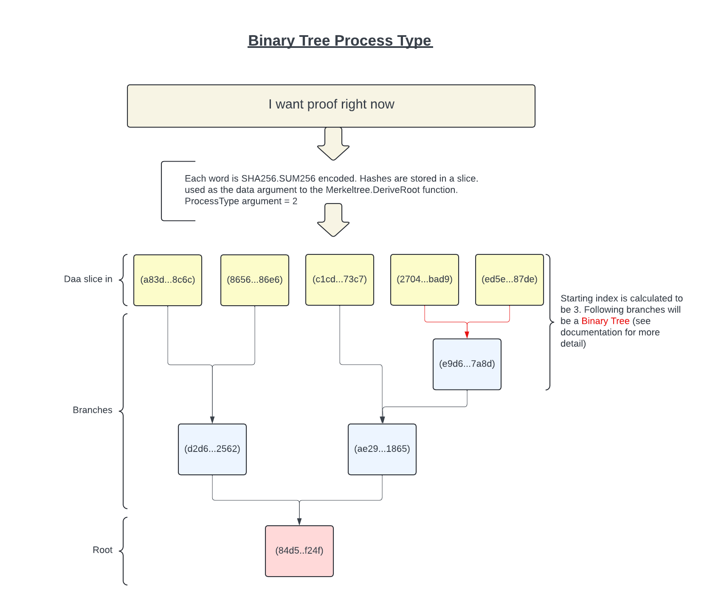

<h1>Merkle Tree</h1>

## Merkle Tree functionality in Go

### General

A hash tree, also known as a Merkle tree<sup>(1)</sup>, is a tree in which each leaf node is labeled with the cryptographic hash of a data block, and each non-leaf, or branch, node is labeled with the cryptographic hash of its child nodes' labels.

<sup>(1)</sup>References:

* [Wikipedia](https://en.wikipedia.org/wiki/Merkle_tree)
* [Brilliant](https://brilliant.org/wiki/merkle-tree/)
* [... 10^3's more ...](https://www.google.com/search?q=merkle+tree)

Hash trees can be used to verify any kind of data stored, handled and transferred in and between computers. They can help ensure that data blocks received from others and even to check that the other peers do not lie or altered and send fake blocks.

This functionality will deliver the root hash of such data collections.

They are mostly known to be used in a blockchain setting, where each transaction in a block is identified by its hash. All transaction hashes in a block are used to derive the root hash, thus producing a crypographic check value.

This Merkel tree function allows the user to specify certain behaviors.

Options available:

* Choose encoding algorithm
* Specify tree creation and Unbalanced tree process type
* Initial branch encoding option

---

### Signature

```go
type Merkletree func(string, [][]byte, int, ...bool) ([]byte, error)
```

---

### Implementation

```go
import github.com/yveshoebeke/Merkletree
```

```go
root, err := merkletree.DeriveRoot(algorithm, data, processType, initialEncoding)
```

---

### Test and Benchmark

Standard evocation:

A custom flag is provided to see a more detailed test result:

```shell
go test -detail
```

The benchmark will give you results running through 10,000 element input slice for all 3 process types, using sha256.Sum256 encoding.

```shell
go test -bench=.
```

---

### General Process Flow Overview


---

### Parameters

There are 3 mandatory parameters and 1 optional.

They are, in order:

1. algorithm
1. data
1. process type
1. initiate with encoding ~(optional)~

#### Algorithm parameter

Accepts a string that denotes the desired hashing algorithm.
The following functionalities are in the registry:

|Ident<sup>(1)</sup>  |  import     | syntax|
|-------------|---------------|----------------|
|MD5          | ```crypto/md5```| ```md5.Sum(data)```|
|SHA1          | ```crypto/sha1``` | ```sha1.Sum(data)```|
|SHA3SUM256    | ```golang.org/x/crypto/sha3``` |```sha3.Sum256(data)```|
|SHA256SUM256  | ```crypto/sha256``` |```sha256.Sum256(data)```|
|SHA512SUM256  | ```crypto/sha512``` |```sha512.Sum256(data)```|
|SHA512SUM512  | ```crypto/sha512``` |```sha512.Sum512(data)```|

<sup>(1)</sup>Will raise an *unknown hash algorithm* error if no match is found.

Note:

* Other schemes can be added by editing the ```cryptofuncs.go``` source.
* Registry signature: ```var AlgorithmRegistry map[string]CryptoFunc```
* Function signature: ```type CryptoFunc func([]byte) []byte```

#### Data

Expected data type: ```[][]byte```<sup>(2)</sup>

<sup>(2)</sup>If empty will raise the *empty list* error.

#### Process Type

There are 3 process types that can be specified. Each one will handle unbalanced trees in it's own manner:

|Value<sup>(3)</sup>|Process Name|
|-----------|-----------|
|0| [Pass Through](#pass-through)|
|1| [Duplicate and Append](#duplicate-and-append)|
|2| [Binary Tree](#binary-tree)|

<sup>(3)</sup>Incorrect value will raise the *invalid process type* error.

Notes:

1. Processing the same input data and subjecting it to different Process Types will obviously result in different Merkle Root values.
1. Some real world usages:
    * *Duplicate and Append* is used in the Bitcoin cryptocurrency/blockchain.
    * *Pass Through* is used in the Monero cryptocurrency/blockchain.

#### Initiate with encodeing

Boolean. ~If not provided, will default to ```false```.~ If set to ```true``` will direct the function to initialize all data in the data parameter to be encoded with the specified hashing algorithm. To be used in case your input contains unencoded data.

---

### Process Types

Processing of a data collection into a tree can result in a so called unbalanced situation. This will manifest itself when an odd number of elements are present in your data colletion (slice).

The following will describe how this can be handled. When working with data that is part of an established scheme, like a blockchain for example, you should select the one that is used in that particular scheme.

Note: You *must* declare one. There is no default.

In the below process flow charts shown, all hashes are sha256.Sum256 and are hex string encoded for output. For brevity only the first and last 4 digits are shown.

All input slices depicted are based on the hashes of the words in the sentence "I want proof right now"

|Word| Hash |
|--|--------------|
|I|a83dd0ccbffe39d071cc317ddf6e97f5c6b1c87af91919271f9fa140b0508c6c|
|want|8656aa55d393b032b7f05fd40daac127c4862315017072b231d726ccf0d686e6|
|proof|c1cda26362828b69266512052b97cb3729e3b052e4ade47c0a1e3383defe73c7|
|right|27042f4e6eca7d0b2a7ee4026df2ecfa51d3339e6d122aa099118ecd8563bad9|
|now|ed5eb9a37e2d8231af3388319b941995f6dc8755c56043d0cc52b5fe405a87de|

#### Pass Through

The last element is passed through to the next branch.


#### Duplicate and Append

This process will create a duplicate of the last element and append it to the end of the slice, thus having in essence 2 equal data elements at the end, making the number of elements even.


#### Binary Tree

A Binary tree has branches where the number of elements are of the 2<sup>x</sup> order.

An initial index is calculated to start the process, after which we will have a binary tree. 

To accomplish this the lowest exponent to raise 2 is determined to obtain a value that is greater than the number of elements (length of) in the slice.

This exponential result is subtracted by the number of elements to obtain the index where the first iteration will start.

The binary logarithm (log base 2) on the length of the input slice will result in the desired exponent. This result will be rounded up to the next integer value.

```text
L = number of elements in the slice.

X = log2(L); X is converted to an integer after rounding it up.

I = 2^X - L; this is the starting index.
```

```go
startIdx := int(math.Pow(2, math.Ceil(math.Log2(float64(len(ms.Leaves)))))) - len(ms.Leaves)
```

Examples:

|Slice length|Exponent|Index|
|---------|-------|------|
| 5 | log2(5) = 2.321 => 3 | 2<sup>3</sup> - 5 = 8 - 5 = 3 |
| 1327 | log2(1327) = 10.374 => 11 | 2<sup>11</sup> - 1327 = 2048 - 1327 = 721 |
| 2048<sup>(*)</sup> | log2(2048) = 11 => 11 | 2<sup>11</sup> - 2048 = 2048 - 2048 = 0 |
| 10000 | log2(10000) = 13.288 => 14 | 2<sup>14</sup> - 10000 = 16384 - 10000 = 6384 |

<sup>(*)</sup> index will always be 0 if length is an exact integer exponent to raise 2 by.



---

### Result

The function returns a slice of bytes.

```go
[]byte
```

---

### Proof

```shell
go run proof/proof.go
```

Notes:

* Needs cosmetic enhancements.
* This README section needs to be completed further.
